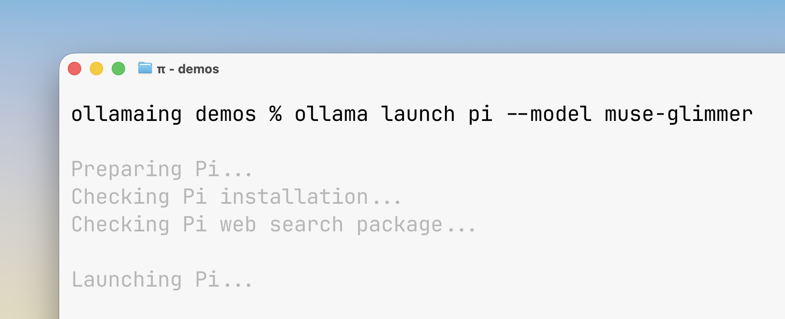

# Ollama

Run Muse Glimmer locally with one command, then connect it to an agent or either of Ollama's chat APIs.



## Install

Install Ollama from [ollama.com/download](https://ollama.com/download).

## Run Muse Glimmer

For the normal/default path, run:

```bash
ollama run muse-glimmer
```

On Apple silicon, you can instead use Ollama's MLX engine:

```bash
ollama run muse-glimmer:30b-mlx
```

## Use Ollama Launch

[`ollama launch`](https://docs.ollama.com/integrations) configures a supported agent to use Ollama, selects Muse Glimmer, and starts the agent:

```bash
ollama launch claude --model muse-glimmer
ollama launch pi --model muse-glimmer
ollama launch opencode --model muse-glimmer
ollama launch hermes --model muse-glimmer
ollama launch openclaw --model muse-glimmer
```

## Call the API

Ollama listens on `http://localhost:11434` by default. The native chat API needs no API key:

```bash
curl http://localhost:11434/api/chat -d '{
  "model": "muse-glimmer",
  "stream": false,
  "messages": [
    {"role": "user", "content": "In one sentence, what is Muse Glimmer good at?"}
  ]
}'
```

OpenAI clients can use the compatible chat-completions endpoint. `ollama` is a placeholder API key for local clients that require one:

```bash
curl http://localhost:11434/v1/chat/completions \
  -H 'Authorization: Bearer ollama' \
  -H 'Content-Type: application/json' \
  -d '{
    "model": "muse-glimmer",
    "messages": [
      {"role": "user", "content": "In one sentence, what is Muse Glimmer good at?"}
    ]
  }'
```

## Troubleshooting

Muse Glimmer requires Ollama 0.32.7 or later. Check your version with:

```bash
ollama --version
```

## Next steps

- Learn the agent loop: [`../agentic-fundamentals/`](../agentic-fundamentals/)
- Compare other runtimes: [`README.md`](README.md)
