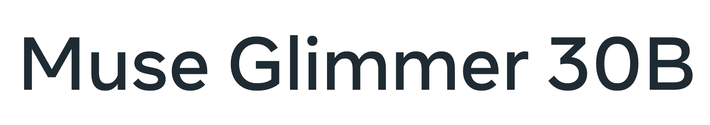

# Unsloth



Run, fine-tune, and serve Muse Glimmer locally via a GUI interface.

Unsloth is an open-source desktop app for running and training Muse Glimmer on local hardware. The app enables OpenAI-compatible API endpoints, agent connections, tool calling, web search, remote access, model exporting, and more.

> [!NOTE]
> Status: Unsloth's Muse Glimmer GGUF build is published at [`unsloth/Muse-Glimmer-30B-GGUF`](https://huggingface.co/unsloth/Muse-Glimmer-30B-GGUF), and the Unsloth workflows below are current. Still pending: a verified tool-calling run. Use the official Meta or Unsloth release artifacts rather than a third-party repack.

## Install

### Download Unsloth

**[Download Unsloth](https://unsloth.ai/download)** for macOS, Windows, Linux, or WSL:

- [Download for macOS](https://unsloth.ai/download/mac)
- [Download for Windows](https://unsloth.ai/download/windows)
- [Download for Linux and WSL](https://unsloth.ai/download/linux)

### Manual installation

Install from a terminal instead of the platform installers. On macOS, Linux, or WSL:

```bash
curl -fsSL https://unsloth.ai/install.sh | sh
```

On Windows PowerShell:

```powershell
irm https://unsloth.ai/install.ps1 | iex
```

Launch it from the installed app shortcut, or run:

```bash
unsloth studio -p 8888
```

See the [Unsloth docs](https://unsloth.ai/docs/) and [platform requirements](https://unsloth.ai/docs/get-started/beginner-start-here/unsloth-requirements).

## Fine-tuning

You can use the Unsloth GUI's 'Train' tab to get started with Muse Glimmer fine-tuning.

For the code-based fine-tuning package, create an isolated environment and install the current release:

```bash
uv venv unsloth_env --python 3.13
source unsloth_env/bin/activate
uv pip install unsloth --torch-backend=auto
```

On Windows, activate the environment with `.\unsloth_env\Scripts\Activate.ps1` in PowerShell. See the [Unsloth installation guide](https://unsloth.ai/docs/get-started/install) for NVIDIA, AMD, Intel, and platform-specific instructions.

## Run and Serve

### Unsloth Desktop

1. Open **Select model** or **Model Hub**, then search for Muse Glimmer and download GGUF, NVFP4 or format of your choice. Select the official Meta checkpoint or Unsloth build. For GGUF, choose a quantization that fits your VRAM, unified memory, and system RAM while leaving room for KV cache.
2. Once the model is downloaded, you can chat with it directly.
3. To serve the model, create an API key under **Settings > API**. Unsloth exposes OpenAI-compatible `/v1/chat/completions` and `/v1/responses` endpoints, plus Anthropic-compatible `/v1/messages`.

Keep localhost binding unless remote access is needed. Keep API keys private and review enabled tools before exposing the server.

For LAN access:

```bash
unsloth studio -H 0.0.0.0 -p 8888
```

For HTTPS tunnel access:

```bash
unsloth studio --secure -p 8888
```

To connect Muse Glimmer to an agentic tool, load Muse Glimmer in Unsloth and run:

```bash
unsloth start claude
```

Change `claude` to any of the [supported agents](https://unsloth.ai/docs/integrations/unsloth-start).

### Unsloth CLI

Unsloth publishes Muse Glimmer GGUFs at [`unsloth/Muse-Glimmer-30B-GGUF`](https://huggingface.co/unsloth/Muse-Glimmer-30B-GGUF) — Dynamic quants from `UD-IQ2_XXS` through `UD-Q8_K_XL`, plus BF16 and the `mmproj` vision projectors.

You can select the model while launching an agent. The `:` suffix picks the quant:

```bash
unsloth start claude \
  --model unsloth/Muse-Glimmer-30B-GGUF:UD-Q4_K_XL \
  --context-length 131072
```

`--gguf-variant UD-Q4_K_XL` does the same job and overrides the suffix. If Unsloth Studio isn't already running, passing `--model` starts a temporary server that stops when the agent exits.

## Verify tool calling

Not yet verified against Muse Glimmer. The endpoint takes OpenAI-style `tools` today, so the check is the same one the other pages run. Use the `id` from `/v1/models` as the model value:

```bash
curl http://localhost:8888/v1/chat/completions \
  -H "Authorization: Bearer $UNSLOTH_STUDIO_AUTH_TOKEN" \
  -H "Content-Type: application/json" \
  -d '{
    "model":"default",
    "messages":[{"role":"user","content":"What is the weather in Paris in celsius? Use the tool."}],
    "tools":[{"type":"function","function":{
      "name":"get_weather","description":"Get current weather for a city.",
      "parameters":{"type":"object","properties":{
        "city":{"type":"string"},"units":{"type":"string","enum":["celsius","fahrenheit"]}},
        "required":["city"]}}}],
    "tool_choice":"auto"}'
```

What you want back is a `tool_calls` array, not the call rendered as plain text. Until that run is recorded here, point agentic recipes at vLLM ([`vllm.md`](vllm.md)).

## Stop tokens

Muse Glimmer needs `eos_token_id = [<|end_of_text|>, <|eot|>]`. Never stop on `<|eom|>`. See [`README.md`](README.md#get-stop-tokens-right).

Unsloth sets inference parameters from the model on load, and the chat template and other per-model settings are editable in the app. The Unsloth docs don't document a stop-token override specifically, and which stop tokens Unsloth applies to Muse Glimmer has not been verified here — confirm it before running long agentic turns, since stopping on `<|eom|>` collapses parallel tool calling.

## Next steps

- Train a Muse Glimmer adapter, then serve it: [Fine-tuning](#fine-tuning) above
- Learn the loop this endpoint drives: [`../agentic-fundamentals/`](../agentic-fundamentals/)
- Serve with the verified path instead: [`vllm.md`](vllm.md)
