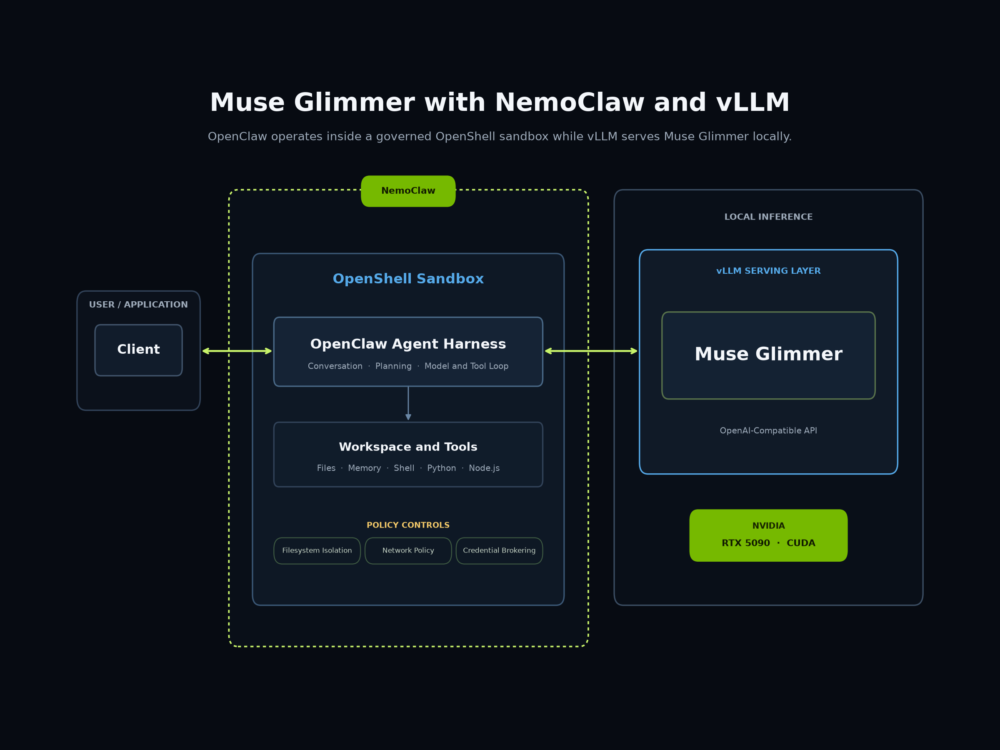

# NVIDIA

NVIDIA data-center GPUs run Muse Glimmer via vLLM with the standard CUDA stack — no plugins required. The serving path here is identical to the reference path in [`../inference-server/vllm.md`](../inference-server/vllm.md).

Once vLLM is serving, the endpoint is OpenAI-compatible and any agent harness can drive it. NVIDIA's [NemoClaw](https://github.com/NVIDIA/NemoClaw) is one such harness — it runs the agent loop inside a sandbox with filesystem, network and credential policy in front of the tools.



The diagram shows the shape on a single workstation GPU. The same wiring applies to the B300 deployment below, with the serving layer on the data-center card instead. For the demo it was built for, see [`../recipes/sandboxed-agent/`](../recipes/sandboxed-agent/).

## Platforms

| Platform | Class | Accelerator | Memory | Precisions verified |
|---|---|---|---|---|
| B300 | server | B300 × 8 | 288 GB HBM3e per GPU | bf16 |

## Performance

| Platform | Precision | Concurrency | TTFT p50 | Output tok/s per request | Output tok/s total |
|---|---|---|---|---|---|
| B300 | bf16 | 1 | 215.6 ms | 85.76 | 76.83 |
| B300 | bf16 | 2 | 307.3 ms | 84.44 | 148.81 |
| B300 | bf16 | 4 | 395.3 ms | 81.99 | 280.96 |
| B300 | bf16 | 8 | 618.7 ms | 77.37 | 503.27 |
| B300 | bf16 | 16 | 979.7 ms | 67.26 | 830.71 |
| B300 | bf16 | 32 | 1747.9 ms | 53.29 | 1,224.67 |
| B300 | bf16 | 64 | 2760.0 ms | 36.53 | 1,632.21 |
| B300 | bf16 | 128 | 3432.2 ms | 19.69 | 1,912.99 |
| B300 | bf16 | 256 | 2790.0 ms | 9.88 | 2,093.52 |

These are **single-GPU** numbers, confirmed by NVIDIA: the cluster node has eight B300s, but only one was used for this sweep — bf16 fits in a single 288 GB card, so the server ran without tensor parallelism. Scale accordingly if you plan to shard.

Measured by NVIDIA on 2026-08-09 with vLLM `0.1.dev19055+g6b0c510ec`, torch 2.13.0+cu130, driver 580.167.08, CUDA 13.0, ISL 2048 / OSL 256 / prefix-cache 32768 tokens. Reproduce with:

```bash
aiperf profile --model '/model' --tokenizer '/model' --url 'http://localhost:8000' \
  --endpoint-type 'chat' --streaming \
  --num-prefix-prompts 1 --prefix-prompt-length 32768 \
  --num-dataset-entries 10240 --dataset-sampling-strategy 'shuffle' --random-seed 7 \
  --isl 2048 --isl-stddev 0 --osl 256 --osl-stddev 0 \
  --concurrency '1,2,4,8,16,32,64,128,256' \
  --request-count '10,20,40,80,160,320,640,1280,2560' \
  --sweep-type 'zip' --warmup-request-count 3 --num-profile-runs 1 \
  --use-server-token-count --use-legacy-max-tokens \
  --extra-inputs 'max_tokens:256' --extra-inputs 'min_tokens:256' \
  --extra-inputs 'ignore_eos:true' --extra-inputs 'temperature:0'
```

## Platform details

### B300

**Snapshot**

| | |
|---|---|
| Accelerator | B300 SXM6 AC × 8 (compute capability 10.3) |
| Memory | 288 GB HBM3e per GPU (275,040 MiB reported) |
| Memory bandwidth | ~8 TB/s per GPU |
| Host OS tested | Ubuntu 24.04.3 LTS |
| Driver / runtime | driver 580.167.08, CUDA 13.0 |
| Model server | vLLM 0.1.dev19055+g6b0c510ec, torch 2.13.0+cu130, transformers 5.14.1 |
| Verified by | Faradawn Yang on 2026-08-10 |

**Prerequisites**

| Requirement | Minimum | Check with |
|---|---|---|
| NVIDIA driver | 580.167.08 (≥580 for Blackwell Ultra sm_103) | `nvidia-smi` |
| CUDA toolkit | 13.0 | `nvcc --version` |
| Python | 3.10 (tested 3.12.3) | `python --version` |
| Disk | 80 GB free for bf16 weights | `df -h` |

**Deploy**

```bash
hf download meta-models/Muse-Glimmer-30B --local-dir ./muse-glimmer-bf16
```

```bash
docker run --rm --gpus all --ipc=host \
  -p 8000:8000 \
  -v "$PWD/muse-glimmer-bf16:/model" \
  vllm/vllm-openai:muse-glimmer \
  /model \
  --served-model-name muse-glimmer \
  --tensor-parallel-size 1 \
  --enable-auto-tool-choice \
  --tool-call-parser muse_glimmer \
  --reasoning-parser muse_glimmer \
  --generation-config auto
```

bf16 fits in a single B300, so `--tensor-parallel-size 1` is correct here even on an 8-GPU node. Confirm the deploy with the tool-calling check in [`../inference-server/vllm.md`](../inference-server/vllm.md).

> [!NOTE]
> NVIDIA's own measurements were taken against vLLM `0.1.dev19055+g6b0c510ec` rather than this container. Muse Glimmer support is not in a released vLLM wheel — it is an [open PR](https://github.com/vllm-project/vllm/pull/51655) — so the container is the path a reader can reproduce. The flags are the same either way.

> [!WARNING]
> Stop tokens: `eos_token_id = [<\|end_of_text\|>, <\|eot\|>]`. Never stop on `<\|eom\|>` — it marks end-of-*message*, the turn continues, and stopping there reduces parallel tool calling to near zero. `--generation-config auto` reads this from the checkpoint. Details: [`../inference-server/README.md`](../inference-server/README.md).

**Supported precisions**

| Precision | Status | Artifact | Memory observed | Notes |
|---|---|---|---|---|
| bf16 | Verified | meta-models/Muse-Glimmer-30B | | Fits in a single B300. |
| fp8 | Works, not verified | | | B300 supports fp8. |

**Troubleshooting**

| Symptom | Cause | Fix |
|---|---|---|
| Tool calls returned as plain text | Parser not enabled | Pass both `--enable-auto-tool-choice` and `--tool-call-parser muse_glimmer`. The chat template ships in the checkpoint, so no `--chat-template` flag is needed. |
| Model runs forever | Runtime overrode stop tokens | Confirm `<\|eom\|>` is not in `eos_token_id`; re-serve with `--generation-config auto`. |
| OOM at large batch sizes | KV cache exhausted | Lower `--max-num-seqs` or reduce `--max-model-len`. |

## Support

- Issues: https://github.com/vllm-project/vllm/issues
- Docs: https://docs.nvidia.com/cuda/
- Maintainer: Faradawn Yang (faradawny@nvidia.com)
