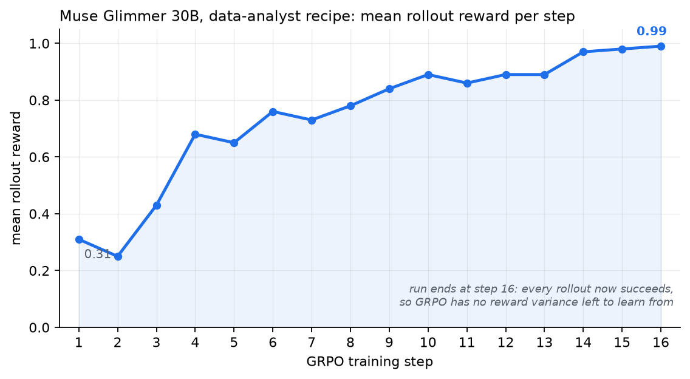
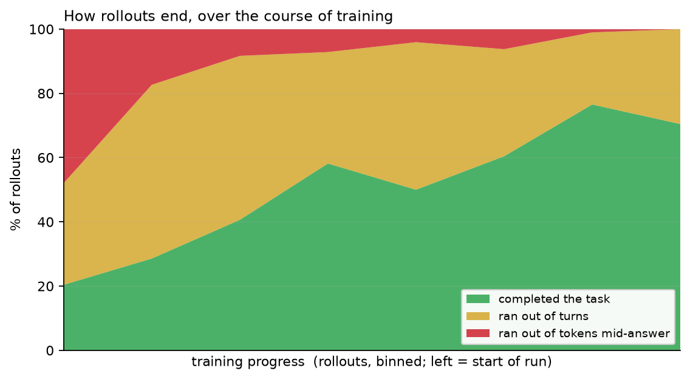

# Data Analyst: post-train Muse Glimmer with a verifiable reward

Teach Muse Glimmer to reliably compute a number from a csv or log file **and write
it to the file it was asked for** -- using reinforcement learning with a
deterministic, machine-checkable reward. No LLM judge, no labelled dataset, no
external services.

## Recipe banner

| | |
|---|---|
| Precision | bf16 |
| Model server | vLLM (TitanRL's in-process generator) |
| Offline? | Yes, after the one-time checkpoint download |
| Hardware verified on | 8x H100 95GB (single node) |
| Max VRAM observed | ~93 GiB of 95 GiB on the busiest trainer GPU; ~88-90 GiB on the others |
| Requires | [TorchTitan](https://github.com/pytorch/torchtitan) `main` with [TitanRL](https://github.com/pytorch/torchtitan/tree/main/torchtitan/rl) (Monarch, TorchStore, vLLM, FlashAttention-3) |

## Does it work?

Mean rollout reward per training step on the public 30B checkpoint, 8 prompts x 8
samples per step:



More useful than the reward line is *why* it rises. Grouping every rollout by
how it ended, across the run:



Rollouts that **ran out of tokens mid-answer go from 48% to 0%**, and completed
rollouts from 20% to 70%. That is the PinchBench failure mode being trained away:
the model stops deliberating and starts computing the number and writing it.
The ~30% that still run out of turns at the end are not failures: every one of
them had already written the correct answer (most with their second command)
and kept re-checking it until the turn limit.

**The run stops at step 15 because the task saturates, not because
anything crashed.** By then every rollout in a group scores 1.0, so GRPO has no
reward variance left, and TitanRL stops with `10 consecutive untrainable batches`.
The four synthetic task templates are learnable that quickly; see
[Make it yours](#make-it-yours) for making them harder.

RL sampling is random, so your run will differ in detail; the shape of the curve
is what to compare. ([W&B run](https://wandb.ai/a-shamsoshoara-m/titan_rl/runs/b3t3h4oz))

## What the model actually does, before and after

Both transcripts are real rollouts from the run above. "Before" is from the first
training groups, before any gradient update.

### Before: deliberates, never acts

````text
PROMPT
  The file `access.log` ... Count how many lines have level `DEBUG`.
  Write the count to `answer.json` as JSON: {"answer": <number>}.

ASSISTANT  (reasoning: 1690 chars, tool calls: none)
  "... Let's inspect file? Could just run grep -c DEBUG. But need to ensure
   line starts with timestamp and level. ...
   Better to first examine first few lines to know format. That would be a
   tool call. Then count and write. That's two calls. Could we do in one
   command? ... Might be okay to just grep for ' DEBUG ' or line contains
   'DEBUG' after timestamp? ..."

  -> ran out of tokens mid-thought; no command ever ran
  -> reward 0.0
````

### After: inspects, writes the answer in one command, checks it, stops

````text
PROMPT
  (same task: count the lines with level `DEBUG`)

TURN 0
  bash: wc -l access.log && head -n 5 access.log
  -> 55 access.log
     <timestamp> ERROR 10.0.4.2 request handled ...

TURN 1
  bash: count=$(grep -c '[[:space:]]DEBUG[[:space:]]' access.log || true); echo "{\"answer\": $count}" > answer.json && cat answer.json
  -> {"answer": 12}                        # graded correct here

TURN 2
  bash: grep ' DEBUG ' access.log | wc -l
  -> 12                                    # cross-checks with a second method

TURN 3
  (no tool call) "The count has been written to `answer.json` ...
  Verified with `grep ' DEBUG ' access.log | wc -l` -> 12."
  -> completed, reward 1.0
````

The trained model checks the format instead of guessing, computes the number and
writes the file in the same command, and stops once it has verified the result.
Nobody asked for the second check in turn 2.

Across the first and last 128 training rollouts of the run:

| | before | after |
|---|---|---|
| rollouts with the correct answer in `answer.json` | 52% | 100% |
| rollouts making **zero tool calls** (deliberate, never act) | 26% | 0% |
| median tool calls per rollout | 5 | 4 |

## The problem this solves

Muse Glimmer scores ~65% overall on PinchBench (a 147-task agentic benchmark) but
only **37% on csv analysis** and **39% on log analysis**. A deep-dive on all 36
failures found something useful: **none of them were analysis errors.** The model
consistently worked out the right answer. What it failed at was the agentic
mechanics around it:

1. It emitted Python with literal `\n` escapes inside a shell heredoc, so the
   shell handed Python invalid syntax and the script never ran.
2. On the `SyntaxError`, it re-sent the *same* broken command instead of trying
   another approach.
3. It ran out of turns without ever writing the output file -- so even runs where
   the correct number appeared in scratch output scored zero.

That is a behavior problem, and behavior is what RL shapes. The reward here is
exactly "did the right number end up in the right file", which is checkable in
microseconds with no judge.

## Quickstart

```bash
# from a TorchTitan checkout set up as in Setup below
python -m torchtitan.rl.train \
  --module torchtitan.rl.examples.glimmer_data_analyst \
  --config rl_grpo_muse_glimmer_30b_data_analyst_smoke \
  --dump-folder outputs/rl/glimmer_data_analyst_smoke
```

This is a 10-step smoke run with a small batch (about 30 minutes on 8x H100). The
curve and transcripts above come from the full config (about 75 minutes):

```bash
python -m torchtitan.rl.train \
  --module torchtitan.rl.examples.glimmer_data_analyst \
  --config rl_grpo_muse_glimmer_30b_data_analyst \
  --dump-folder outputs/rl/glimmer_data_analyst
```

To plot your own run and print the before/after numbers:

```bash
uv pip install matplotlib
python "$COOKBOOK/post-training/rl/titanrl/data-analyst/scripts/plot_results.py" \
  outputs/rl/glimmer_data_analyst
```

## Setup

**1. Clone TorchTitan and create a venv.**

```bash
COOKBOOK=/absolute/path/to/meta-oss-cookbook
git clone https://github.com/pytorch/torchtitan.git
cd torchtitan
pip install uv
uv venv --python 3.12 glimmer-rl
source glimmer-rl/bin/activate
```

**2. Install TorchTitan and TitanRL.** These are TitanRL's
[Quick Start](https://github.com/pytorch/torchtitan/tree/main/torchtitan/rl#quick-start)
steps for H100, with TorchTitan's own `requirements.txt` first:

```bash
uv pip install -r requirements.txt
uv pip install -r torchtitan/rl/requirements.txt
uv pip install --no-deps "git+https://github.com/meta-pytorch/torchstore.git@main"
uv pip install flash-attn-3 --extra-index-url=https://download.pytorch.org/whl/test/cu130
uv pip install torch torchvision vllm --pre \
  --extra-index-url https://download.pytorch.org/whl/nightly/cu130 \
  --index-strategy unsafe-best-match
```

Keep this order: vLLM must be installed last. The last command leaves out
`torchcomms`, which TitanRL's Quick Start also lists; it is not needed on a single
node, and including it makes the install fail (see
[Troubleshooting](#troubleshooting)).

**3. Install this recipe** into the TorchTitan checkout:

```bash
cp -R "$COOKBOOK/post-training/rl/titanrl/data-analyst/titanrl_files" \
  torchtitan/rl/examples/glimmer_data_analyst

export PYTHONPATH="$PWD:${PYTHONPATH:-}"
uv pip install pytest
pytest torchtitan/rl/examples/glimmer_data_analyst/tests/ -v
# -> 17 passed, no GPU required
```

**4. Download the open-weights checkpoint** (~56 GB, one time):

```bash
python scripts/download_hf_assets.py \
  --repo_id meta-models/Muse-Glimmer-30B \
  --local_dir torchtitan/rl/example_checkpoint \
  --all
```

**5. Before each run**, from the TorchTitan checkout:

```bash
source glimmer-rl/bin/activate
export PYTHONPATH="$PWD:${PYTHONPATH:-}"   # Monarch-spawned workers import from it
wandb login                                # or add --metrics.no-enable-wandb
```

## What just happened

Each rollout is one generated task. The model is dropped into a scratch directory
containing a `data.csv` or `access.log`, given a question with a single numeric
answer, and handed exactly one tool: `bash`.

```
prompt   "Count how many lines have level WARN. Write the count to
          answer.json as JSON: {"answer": <number>}."

turn 0   bash: ls -la                                  -> sees access.log
turn 1   bash: head -n 20 access.log                   -> inspects the format
turn 2   bash: grep -c ' WARN ' access.log > /tmp/n && python3 -c "..."
                                                       -> writes answer.json
done     env checks answer.json against the golden value -> reward
```

Four moving parts, one file each:

| File | Role |
|---|---|
| `data.py` | Generates the tasks. Four templates (csv sum, csv group-by-max, log count, log top-status), each with the golden answer computed at generation time. Endless, seeded, and **fully offline** -- there is no dataset to download. Train and validation draw from disjoint index ranges. |
| `env.py` | The `bash` tool and a private scratch directory per rollout. Grades the workspace after every command. |
| `rubric.py` | Turns those checks into a reward. |
| `config_registry.py` | GRPO/DAPO hyperparameters, the GPU split, and the rollout wiring: dataset + env + rubric + turn/token budget. |

**Why `bash` and not a clean `run_python(code=...)` tool.** The bug being fixed
lives in the shell boundary -- broken heredoc quoting. A tool that took code as a
JSON string would route around the bug rather than teach the model to get it
right, and the fix wouldn't transfer to a real terminal-using agent.

**The reward is graded, not pass/fail:**

| Outcome | Reward |
|---|---|
| Correct number in `answer.json` | **1.0** |
| Well-formed file, wrong number | 0.25 |
| File written but malformed | 0.15 |
| At least one command ran successfully | 0.05 |
| Nothing | 0.0 |
| *(minus)* each repeat of an already-failed command | −0.05 |

The tiers are not decoration. GRPO learns from *differences between rollouts of
the same prompt*: if every attempt scores 0 because none fully succeeds, the group
has no variance, the batch is discarded, and the model never gets a gradient. The
tiers make a partially-competent attempt outrank a flailing one -- while keeping
correctness strictly dominant, so partial credit can never beat a right answer.

## Make it yours

**Make the tasks harder.** The shipped templates saturate in about 15 steps (see
above). For a longer run, add instances the model cannot solve in one command:
multi-step aggregations, joins across columns, malformed rows that have to be
handled, ambiguous schemas that need inspection first. A difficulty curriculum
-- easy instances early, harder ones once reward climbs -- keeps reward variance
alive, which is what GRPO needs.

**Swap in your own task.** Add a template to `data.py`. It needs to return a
`GlimmerDataAnalystSample`: the prompt, the input filename and contents, and the
golden value. Everything else -- env, reward, config -- works unchanged. This is
the cheapest way to point the recipe at a task you care about.

**Change what gets rewarded.** The tiers in `rubric.py` are config fields. Set
`file_exists_credit=0.0` and `file_parses_credit=0.0` for a strict 0/1 reward, or
raise `repeated_failing_command_penalty` to punish thrashing harder. The reward
does not charge for extra turns, which is why trained rollouts often re-check a
correct answer until the turn limit; lower `max_num_turns` to cap that.

**Tune the rollout budget** in `config_registry.py` (`_data_analyst_rollouter_config`). If you widen `max_num_turns` or the
generator's `max_tokens`, raise `max_rollout_tokens` and the trainer's
`max_context_length` to match -- a rollout that outgrows its budget is killed as
`truncated_prompt_too_long`, and that silently looks like the model failing.

### Sizing, if you are adapting this

Adam's fp32 `m`/`v` are allocated on the **first** `optimizer.step()`, so per-GPU
memory jumps sharply between step 1 and step 2 -- a run that looks comfortable
during step 1 can still fail right after. Size for the post-step-1 number.

This recipe uses trainer FSDP=3 x TP=2 on six GPUs and generator TP=2 on two
(Muse Glimmer's 2 KV heads cap generator TP at 2). Headroom is thin: the busiest trainer GPU peaks at
~93 GiB of 95 GiB, the rest at ~88-90 GiB.
A longer context, a larger microbatch, or a bigger batch needs more GPUs.

## Troubleshooting

| Symptom | Cause | Fix |
|---|---|---|
| `vllm==0.2.5` starts building from source and fails with a CUDA version mismatch | uv could not find matching nightly `torch` and `vllm` wheels, usually because `torchcomms` was included | Install `torch torchvision vllm` together without `torchcomms`, as in Setup step 2 |
| `terminate called after throwing an instance of 'tvm::ffi::Error'` ... ``TypeAttr `__ffi_repr__` is already registered`` | Something installed after vLLM (for example `flash-attn-4`, or re-running `requirements.txt`) upgraded `apache-tvm-ffi` past the version vLLM needs | Re-run the last command of Setup step 2 so vLLM restores its dependencies |
| OOM in `_split_w13_on_save` during weight sync | Your TorchTitan checkout is older than the fix for this | Pull the latest `main` |
| Generator silent for a few minutes on the first run | FlashInfer is compiling its sampling kernels | Expected once; later runs use the cache |
| `ModuleNotFoundError` for `grain`, `datasets`, `tyro`, `attn_gym`, or `torch_remat` | TorchTitan's own dependencies are missing | Run `uv pip install -r requirements.txt`, then re-run the last command of Setup step 2 |
| `num_tokens_per_microbatch_per_dp_rank must be divisible by max_context_length` | The two are set independently | Make the microbatch budget a multiple of the context length |
| Most rollouts end `truncated_prompt_too_long` | Per-turn generation budget x turns exceeds the rollout token budget | Shrink `sampling.max_tokens` / `max_num_turns`, or raise `max_rollout_tokens` and the context length together |
| Repeated `Consecutive untrainable batches` warnings early in a run | Every rollout in a group scored the same, so GRPO has no signal | Use a graded reward (see above); check whether rollouts are truncated before they can succeed |

## Next steps

- [`../../../../agentic-fundamentals/`](../../../../agentic-fundamentals/) -- the tool-use loop
  and ATEM tool-call format this recipe trains against.
- [TitanRL docs](https://github.com/pytorch/torchtitan/tree/main/torchtitan/rl)
  -- the framework: rollouters, environments, rubrics, and the async controller.
- [`search_r1`](https://github.com/pytorch/torchtitan/tree/main/torchtitan/rl/examples/search_r1)
  -- the multi-turn retrieval recipe this one is modeled on, if your task needs an
  external tool service rather than a local sandbox.
