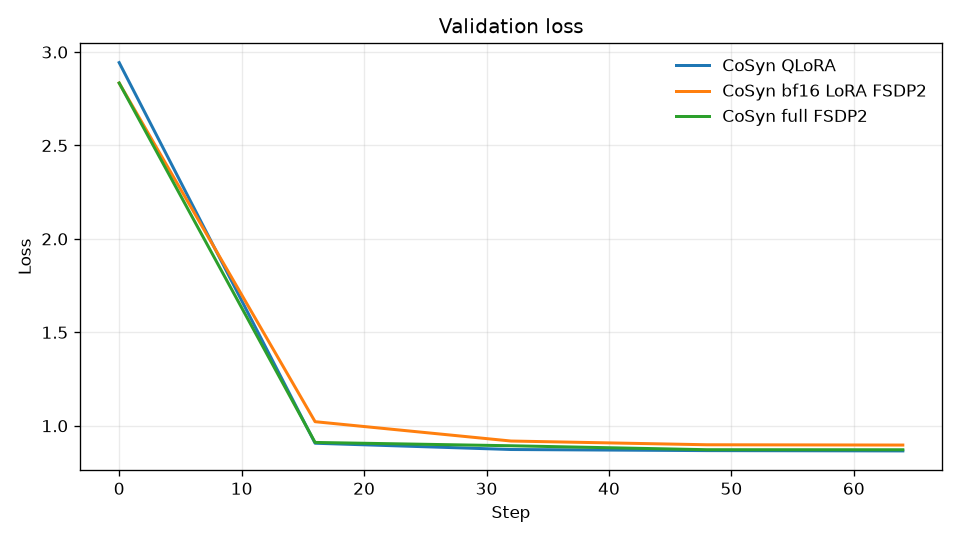
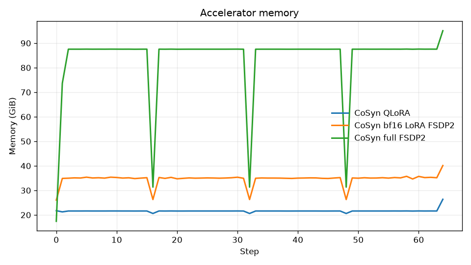
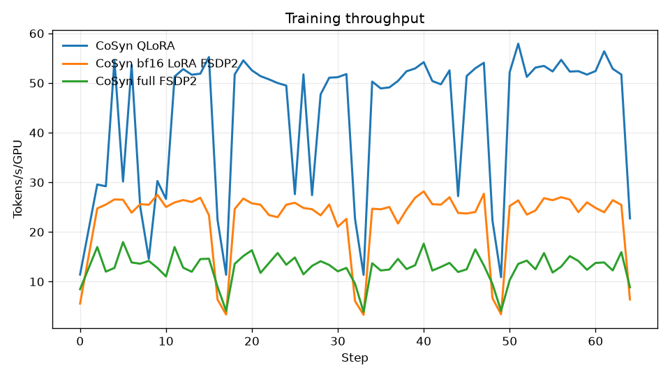
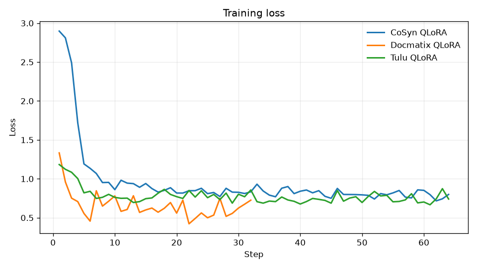
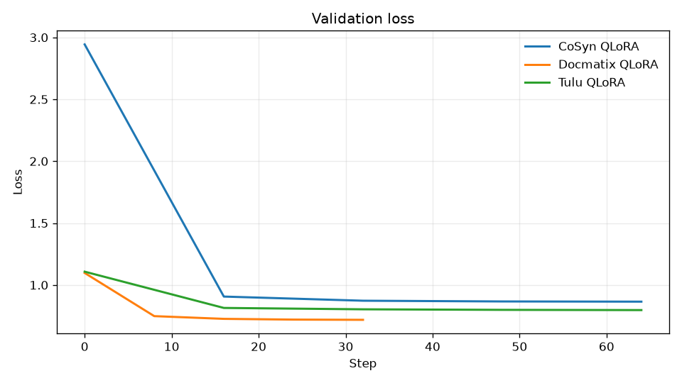
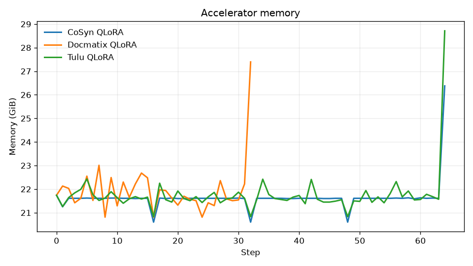
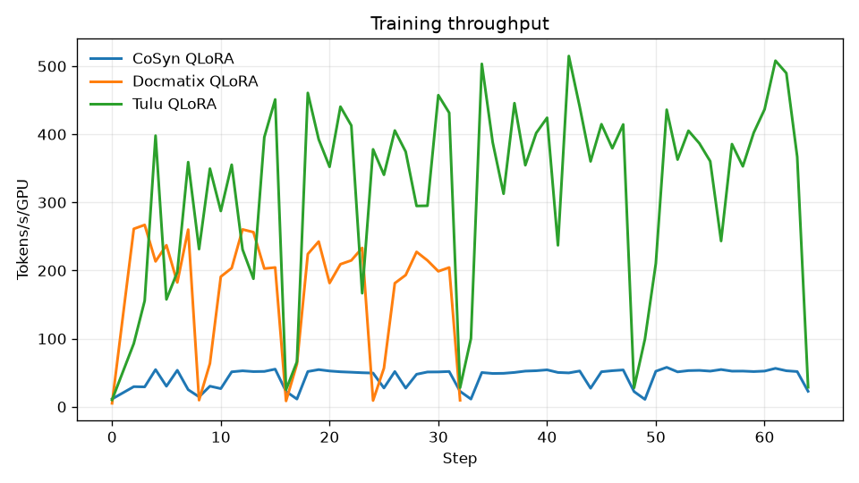
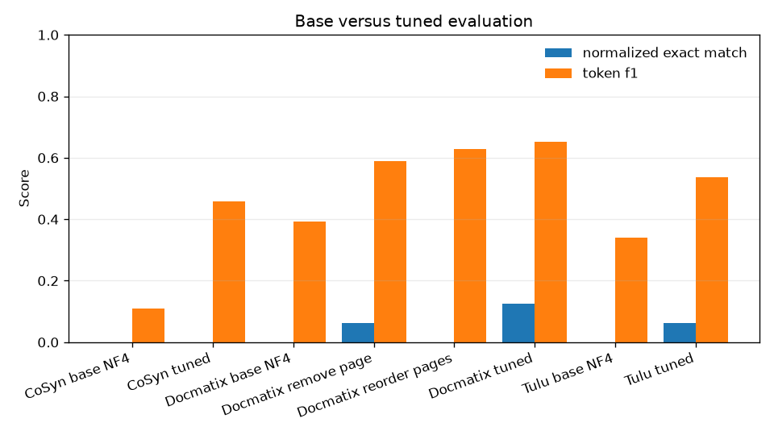

# Supervised fine-tuning Muse Glimmer with Axolotl

Fine-tune Muse Glimmer on your own text and image demonstrations with Axolotl.
Start with QLoRA, compare it with bf16 LoRA, and use full-parameter FSDP2 only
when adapters do not provide enough capacity.

## Recipe banner

| | |
|---|---|
| Precision | bf16 compute; QLoRA loads the frozen base in 4-bit |
| Default method | QLoRA |
| Alternatives | bf16 LoRA with FSDP2; full-parameter bf16 with FSDP2 |
| Trainer | [Axolotl 0.19.0][axolotl-release] |
| Model | Muse Glimmer 30B at a pinned revision |
| Hardware target | 8x H100, one node |
| Hardware verified on | 8x H100 for all methods; QLoRA also on 1x H100 |
| Max VRAM observed | 97,340 MiB/GPU during full FSDP2 final save |
| Experiment tracking | Weights & Biases (W&B) |
| Model server | None during training |
| Offline? | Downloads and online W&B need network |

All configs pin `meta-models/Muse-Glimmer-30B` to revision
`a4e59da52a7bc87ae7251dd5545c0dd437c44b68`.

> [!IMPORTANT]
> All three paths completed controlled quality runs on eight H100s. The final
> adapters and full checkpoint reload. For bf16 LoRA, keep FSDP2 activation
> checkpointing disabled: with Axolotl 0.19.0 it leaked checkpoint-wrapper names
> into the gathered adapter, and PEFT skipped those weights on reload. The
> measured results below use the corrected, reloadable adapter.

## Quickstart

After completing [Setup](#setup) and preparing CoSyn Circuit, start with this
bounded QLoRA smoke run on all eight GPUs:

```bash
CUDA_VISIBLE_DEVICES=0,1,2,3,4,5,6,7 \
  axolotl train configs/muse-glimmer-30b-qlora.yaml \
  --max-steps 2 \
  --gradient-accumulation-steps 1 \
  --eval-strategy no \
  --save-strategy steps --save-steps 2 \
  --launcher torchrun -- --nproc_per_node=8 --nnodes=1
```

QLoRA is the first run for a reason: only the adapters are trainable, while the
frozen base is held in 4-bit form. It gives the cheapest end-to-end check of the
model, data, collator, checkpoint, and evaluation path. Eight GPUs provide data
parallel throughput here; they are not evidence that QLoRA requires eight H100s.
The overrides use a global batch of 8, cross the optimizer-state boundary, and
stop. After that passes, remove them to use the config's one epoch, global batch
of 32, validation, and epoch checkpoint.

## Choose a training method

The three configs use the same prepared CoSyn Circuit split and a global batch
of 32 examples on eight GPUs. That keeps the data and effective batch constant
while you compare memory, throughput, and held-out quality.

**QLoRA:**
[`muse-glimmer-30b-qlora.yaml`](configs/muse-glimmer-30b-qlora.yaml) trains LoRA
adapters over a 4-bit frozen base. Use it for the first run and fast iteration.

**LoRA with FSDP2:**
[`muse-glimmer-30b-lora-fsdp2.yaml`](configs/muse-glimmer-30b-lora-fsdp2.yaml)
trains adapters over a bf16 frozen base sharded with FSDP2. Use it when you want
adapters without base quantization.

**Full-parameter FSDP2:**
[`muse-glimmer-30b-full-fsdp2.yaml`](configs/muse-glimmer-30b-full-fsdp2.yaml)
updates every parameter and uses FSDP2 to shard its training state. Use it only
after an evaluation shows that adapter capacity is the bottleneck.

The upstream Axolotl release includes Muse Glimmer QLoRA examples for language
and vision. It does not include a Muse Glimmer bf16 LoRA, full-parameter, or
FSDP2 example. The latter two configs in this recipe extend those upstream
building blocks and passed the bounded validation described below.

Both adapter configs target language projections only. The vision tower,
adapter, and projection stay frozen. That is the conservative default for a
small domain dataset: adapt how the language model uses visual features without
rewriting the visual encoder. Expanding the target set needs its own regression
test against general image prompts.

## Setup

Run these commands from `post-training/sft/axolotl/`. Use a dedicated environment so the
CUDA and compiled-extension pins do not leak into another project.

```bash
uv venv --python 3.12 .venv
source .venv/bin/activate

export UV_TORCH_BACKEND=cu130
uv pip install "torch==2.12.1" "torchvision==0.27.1"
uv pip install "axolotl==0.19.0"
uv pip install "pytest==9.1.1" "matplotlib==3.11.2"

CUDA_HOME=/usr/local/cuda-13.0 \
CC=/usr/bin/gcc \
CXX=/usr/bin/g++ \
TORCH_CUDA_ARCH_LIST=9.0 \
  uv pip install --no-build-isolation "flash-attn==2.8.3"

CCE_REPOSITORY=https://github.com/axolotl-ai-cloud/ml-cross-entropy.git
CCE_REVISION=4dfa52212d0552805aec5a6a2176c0abbea277d2
CUDA_HOME=/usr/local/cuda-13.0 \
CC=/usr/bin/gcc \
CXX=/usr/bin/g++ \
TORCH_CUDA_ARCH_LIST=9.0 \
  uv pip install --no-build-isolation \
  "cut-cross-entropy[transformers] @ git+${CCE_REPOSITORY}@${CCE_REVISION}"

uv pip check
pytest -q tests
```

Axolotl 0.19.0 is the version used to construct the configs. Its optional
`deepspeed-kernels` dependency did not provide a compatible Python 3.12 wheel in
the environment used for the compatibility check. These configs use FSDP2, not
DeepSpeed, so do not install the `deepspeed` extra.

This sequence was replayed in a fresh Python 3.12 environment on the 8x H100
node. Package checks and imports passed, and all eight GPUs were visible. The
explicit CCE commit matches Axolotl 0.19.0. Keep the CUDA toolkit, PyTorch
backend, and H100 architecture settings together when rebuilding either
compiled extension.

Authenticate W&B without putting a credential in YAML or shell history:

```bash
wandb login
```

Each config sets a common project and a method-specific run name. W&B records
per-step loss, learning rate, token throughput, and GPU system metrics. Axolotl
also uploads the input YAML, but that file does not include computed defaults or
CLI overrides. Preserve the normalized config printed at startup with the run
logs. W&B does not replace a held-out evaluation. Model artifact uploads are
disabled by default because even adapters can encode private training data. Set
`wandb_log_model: end` only after reviewing the artifact's data policy, quota,
and retention.

For a disconnected training node, cache the model and dataset first. In a copy
of the chosen config, change:

```yaml
wandb_mode: offline
```

After the run, move the local W&B directory to a connected host and run
`wandb sync <run-directory>`.

## Prepare the canonical single-image data

The runnable configs use the `circuit` subset of [CoSyn-400K][cosyn] at
revision `86e46e1fd5e754d056169f0fb38f06c6997ff7de`. The dataset card reports 10,470 training images and 128 validation images under
the ODC-BY-1.0 license. Each circuit image has parallel question, explanation,
and answer lists. The preparation script emits one conversation per question
and answer pair, reusing the saved image path. The manifest records the actual
source and output counts for the pinned conversion.

```bash
python scripts/prepare_dataset.py cosyn-circuit \
  --tokenizer-model meta-models/Muse-Glimmer-30B \
  --tokenizer-revision a4e59da52a7bc87ae7251dd5545c0dd437c44b68 \
  --max-tokens 4096
```

It writes:

```text
data/prepared/cosyn-circuit/
  train.jsonl
  validation.jsonl
  manifest.json
  images/{train,validation}/
```

The manifest records source revisions, preparation choices, content hashes for
the JSONL and image files, and data statistics. Inspect it before launching.
Keep the validation split out of `train.jsonl`, and do not tune on it after
looking at evaluation results.

For a quick pipeline check, cap each split rather than editing the output:

```bash
python scripts/prepare_dataset.py cosyn-circuit \
  --max-examples-per-split 16 --output-root data/smoke
```

To exercise the pinned processor and enforce the 4,096-token limit without model
weights, prepare a small separate preflight set:

```bash
python scripts/prepare_dataset.py cosyn-circuit \
  --max-examples-per-split 16 \
  --output-root data/preflight \
  --tokenizer-model meta-models/Muse-Glimmer-30B \
  --max-tokens 4096
```

The configs set `skip_prepare_dataset: true`, so `axolotl preprocess` exits
without exercising this multimodal path. The processor preflight and two-step
training smoke cover different failure classes; run both.

## Three data scenarios

Axolotl consumes OpenAI-style `messages`. Text can be a string. Multimodal user
content is an ordered list of typed image and text parts. The preparation
utility normalizes all three recommended datasets into that representation.
See [`data/README.md`](data/README.md) for source, split, safety, processor
preflight details, and the complete JSON records behind these samples.

### Prepared dataset examples

**Tulu text-only:** the Tulu track contains no image by design. Its concrete
user and assistant message example is in [`data/README.md`](data/README.md#tulu-text-example).

**CoSyn single-image:** this is the exact 512x512 prepared circuit used by the
JSON example in the data guide.


**Docmatix multi-image:** these are the two exact prepared pages, displayed left
to right in the same order they enter the model.


The Docmatix example was selected to avoid personal data. Review the rights and
privacy properties of every source document before redistributing your own
samples.

### Text-only conversations

Use text SFT for instruction following, domain language, and response structure:

```json
{
  "messages": [
    {"role": "user", "content": "Explain why the check failed."},
    {"role": "assistant", "content": "The input omitted the required ID."}
  ]
}
```

The example source is [Tulu 3 SFT Personas][tulu] at revision
`fe0c7d350c9b4542b8d829a6f1daa1c259f0ba0e`. Its card reports 29,980
training rows, it uses this messages shape directly, and it is ODC-BY-1.0
licensed.

```bash
python scripts/prepare_dataset.py tulu \
  --tokenizer-model meta-models/Muse-Glimmer-30B \
  --max-tokens 4096
```

To use it, point a copy of the QLoRA config at
`data/prepared/tulu/train.jsonl` and its validation file. Do not mix all three
example datasets merely because the trainer accepts a list. A useful mixture has
a task-driven sampling policy and a held-out evaluation for each component.

### One image per conversation

Put the image before the question so the content order matches the conversation:

```json
{
  "messages": [
    {
      "role": "user",
      "content": [
        {"type": "image", "path": "images/circuit.png"},
        {"type": "text", "text": "What is connected to the output?"}
      ]
    },
    {"role": "assistant", "content": "A 10 kOhm load resistor."}
  ]
}
```

CoSyn Circuit is the canonical path because it exercises the vision stack
without adding the variable number of pages found in document data. Each
question and answer pair becomes its own conversation with one assistant target.
The explanation is visible assistant text before the short answer. It is never
emitted as hidden `reasoning_content`; the manifest records that policy.

### Multiple images per conversation

Place every image inline and in semantic order before the associated question:

```json
{
  "messages": [
    {
      "role": "user",
      "content": [
        {"type": "image", "path": "images/page-01.png"},
        {"type": "image", "path": "images/page-02.png"},
        {"type": "text", "text": "Compare the totals on both pages."}
      ]
    },
    {"role": "assistant", "content": "The second total is 18 percent higher."}
  ]
}
```

The example source is [Docmatix][docmatix], subset `zero-shot-exp`, at revision
`0725b65616e0e5f6024be10e38ddf8d8c48664fd`. Its card reports 1,700
training and 200 test documents under the MIT license. The preparation script
keeps documents with two to four pages, preserves page order, and records the
actual filtering and split counts in the manifest.

```bash
python scripts/prepare_dataset.py docmatix \
  --tokenizer-model meta-models/Muse-Glimmer-30B \
  --max-tokens 4096
```

Do not use a legacy top-level `images` column for this case. Axolotl 0.19.0's
compatibility path retains only index zero from that column. Inline image parts
in `messages[*].content` preserve every page. Also keep
`sample_packing: false` and `eval_sample_packing: false`; image sample packing
is not supported here.

Image count is not the same as multi-image reasoning quality. Keep single-image
and multi-image evaluation sets separate so a gain on document questions cannot
hide a regression on ordinary vision prompts.

## Launch on one 8x H100 node

Start with the bounded validation commands below. Each crosses two optimizer
steps, skips the full validation set, and writes a checkpoint at step 2. The
full-parameter smoke still needs about 222 GB for one sharded training
checkpoint plus its consolidated model.

```bash
# QLoRA
CUDA_VISIBLE_DEVICES=0,1,2,3,4,5,6,7 \
  axolotl train configs/muse-glimmer-30b-qlora.yaml \
  --max-steps 2 --gradient-accumulation-steps 1 \
  --eval-strategy no --save-strategy steps --save-steps 2 \
  --launcher torchrun -- --nproc_per_node=8 --nnodes=1

# bf16 LoRA with FSDP2
CUDA_VISIBLE_DEVICES=0,1,2,3,4,5,6,7 \
  axolotl train configs/muse-glimmer-30b-lora-fsdp2.yaml \
  --max-steps 2 --gradient-accumulation-steps 1 \
  --eval-strategy no --save-strategy steps --save-steps 2 \
  --launcher torchrun -- --nproc_per_node=8 --nnodes=1

# Full-parameter bf16 with FSDP2
CUDA_VISIBLE_DEVICES=0,1,2,3,4,5,6,7 \
  axolotl train configs/muse-glimmer-30b-full-fsdp2.yaml \
  --max-steps 2 --gradient-accumulation-steps 1 \
  --eval-strategy no --save-strategy steps --save-steps 2 \
  --launcher torchrun -- --nproc_per_node=8 --nnodes=1
```

Do not start with a long run. First set a very small step limit in a copy of the
config and cross at least two optimizer steps. Optimizer state is created on the
first step, so a process that only reaches the first forward and backward pass
has not established peak memory.

The full-parameter path uses `adamw_torch_fused`. Avoid a bitsandbytes 8-bit
optimizer with FSDP2 unless that exact combination has been validated for this
model and Axolotl release.

## What just happened

`torchrun` started one Axolotl worker per visible GPU. QLoRA loaded a quantized,
frozen base and attached trainable adapters to language projections. LoRA kept
a bf16 frozen base, used the same language-only targets, and used FSDP2 to shard
state. In both cases, the frozen vision components still supply image features.
Full-parameter training removed the adapters and sharded model parameters,
gradients, and optimizer state across all eight workers.

For image samples, `AutoProcessor` applies Muse Glimmer's chat template and
image processing before the multimodal collator forms a batch. Packing remains
disabled because concatenating independently sized image samples would break
the mapping between image tokens and pixels.

Every worker participates in distributed training. Axolotl creates one W&B run.
FSDP2 workers write sharded periodic checkpoints; adapter runs gather the final
PEFT adapter, while full training gathers the configured full state. Compare the
three runs within one W&B project, but compare quality only at equivalent data
and evaluation points.

## Verification status

The completed validation matrix is:

| Check | Status |
|---|---|
| Clean uv setup, imports, and dependency check | Passed |
| Processor and collator accept one sample containing two images | Passed |
| All three YAML files pass the Axolotl 0.19.0 config schema | Passed |
| Dataset preparation unit tests | Passed |
| Pinned CoSyn Hub and processor preflight | Passed: 32 per split |
| QLoRA crosses two optimizer steps on 1x and 8x H100 | Passed |
| bf16 LoRA FSDP2 crosses two optimizer steps on 8x H100 | Passed |
| Full-parameter FSDP2 crosses two steps and resumes to step 3 | Passed |
| Saved QLoRA, corrected bf16 LoRA, and full checkpoint reload | Passed |
| Five controlled quality runs with online W&B logging | Passed |
| Fixed-ID base versus tuned generation | Passed: 16 examples per dataset |
| Docmatix page removal and reorder counterfactuals | Passed |
| Canonical full-dataset training | Not run |

### Controlled quality runs

These are bounded, one-epoch slice results, not production benchmarks. CoSyn and
Tulu used 2,048 train and 256 validation examples, global batch 32, and 64
optimizer steps. Docmatix used 256 train and 36 validation documents, global
batch 8, and 32 steps. Every run used eight H100s, seed 42, the same 4,096-token
limit, and online W&B logging.

| Dataset | Method | Validation loss, step 0 to final | Trainer runtime | Peak MiB/GPU | W&B |
|---|---|---:|---:|---:|---|
| CoSyn | QLoRA | 2.9434 to 0.8655 | 320.4 s | 27,011 | [o3disfur][wandb-quality-cosyn-qlora] |
| CoSyn | bf16 LoRA FSDP2 | 2.8341 to 0.8968 | 651.1 s | 41,094 | [3y6r7c5h][wandb-quality-cosyn-lora] |
| CoSyn | Full bf16 FSDP2 | 2.8341 to 0.8717 | 1,105 s | 97,340 | [hx05hx9u][wandb-quality-cosyn-full] |
| Tulu | QLoRA | 1.1078 to 0.7973 | 327.2 s | 29,401 | [i8uuy1o0][wandb-quality-tulu] |
| Docmatix | QLoRA | 1.0974 to 0.7187 | 80.81 s | 28,052 | [2w8rql9f][wandb-quality-docmatix] |

Peak memory is the maximum device use sampled by `nvidia-smi` every two seconds,
including final save. Full FSDP2 reached 97,340 MiB while consolidating its final
checkpoint, so it has almost no margin on a 97,871 MiB H100. The W&B exports,
evaluation summaries, plot inputs, and reproduction commands are in
[`results/`](results/).







#### QLoRA across text, single-image, and multi-image data

The following plots contain all three datasets. Loss values are task-dependent,
so compare the shape of each curve rather than ranking datasets by absolute
loss. Throughput differs mainly because Tulu text is shorter than CoSyn images
and multi-page Docmatix inputs.









#### Fixed held-out generation

The deterministic generation check used the same 16 hash-selected validation
IDs for base and tuned models. Decoding was greedy with seed 42, low reasoning,
a fixed date of 2026-09-17, a 512-token cap, and explicit Muse `<|eot|>`
stopping. Token F1 is more informative than exact match for the explanatory
CoSyn and open-ended Tulu references.

| Comparison | Matched base token F1 | Tuned token F1 | Base exact match | Tuned exact match |
|---|---:|---:|---:|---:|
| CoSyn NF4 to QLoRA | 0.1099 | 0.4586 | 0.0000 | 0.0000 |
| CoSyn bf16 to bf16 LoRA FSDP2 | 0.1096 | 0.4430 | 0.0000 | 0.0000 |
| CoSyn bf16 to full bf16 FSDP2 | 0.1096 | 0.4251 | 0.0000 | 0.0000 |
| Tulu NF4 to QLoRA | 0.3391 | 0.5379 | 0.0000 | 0.0625 |
| Docmatix NF4 to QLoRA | 0.3926 | 0.6532 | 0.0000 | 0.1250 |

Each QLoRA comparison uses an NF4 base with the same quantization settings as
the tuned adapter. LoRA and full FSDP2 use the same bf16 base. Generation-cap
exhaustions remain zero-score examples rather than being dropped: four for the
bf16 CoSyn base, three for the NF4 CoSyn base, two for the NF4 Tulu base, and
one for the NF4 Docmatix base. On the same Docmatix IDs, tuned token F1 fell
from 0.6532 to 0.5895 when page zero was removed and to 0.6279 when pages were
reversed. This is evidence that the multi-image path uses page content and
order, but 16 examples are too few for a general quality claim.



### Mechanics smoke runs

The earlier smoke runs used 512x512 CoSyn examples, a global batch of 8, and at
most three optimizer steps. They establish mechanics only. Peak device memory
was sampled with `nvidia-smi` every two seconds:

| Method | GPUs | Peak MiB/GPU | Trainer runtime | W&B |
|---|---:|---:|---:|---|
| QLoRA | 1 | 26,995 | 25.44 s | [d4d13jz5][wandb-qlora-1] |
| QLoRA DDP | 8 | 27,211 | 14.89 s | [j3scit5e][wandb-qlora-8] |
| bf16 LoRA FSDP2 | 8 | 32,966 rank 0 | 30.68 s | [sa5zaed3][wandb-lora] |
| Full FSDP2 | 8 | 57,608 rank 0 | 3 steps with resume | [train][wandb-full], [resume][wandb-full-resume] |

The full smoke wrote a roughly 56 GB consolidated model plus a roughly 166 GB
sharded training checkpoint. A resume from checkpoint 2 restored optimizer and
token counters, completed step 3, and wrote checkpoint 3. Its generated output
repeated answer markers, demonstrating why a mechanics smoke must not be
presented as quality evidence.

## Make it yours

**Replace the data, not the schema.** Convert your examples to `messages`, keep
image parts inline, and pin both source and conversion versions in a manifest.
Review licenses, consent, privacy, and redistribution rights before training.

**Change one axis at a time.** Establish QLoRA on a small, representative slice.
Then compare LoRA or full-parameter training with the same split, sequence
length, effective batch size, seed, and evaluation. Otherwise the W&B runs do
not isolate the training method.

**Choose adapter targets deliberately.** The shipped adapters target language
projections and freeze the vision components. Visual domain shift may justify
expanding the target set. Updating both stacks on a small or narrow dataset can
overfit both, so verify with separate text and vision regression sets.

**Scale sequence and image limits from real data.** Use the manifest
distribution rather than the largest possible context. Longer text and more
images increase activation memory even when the base weights are quantized.

## Troubleshooting

| Symptom | Cause | Fix |
|---|---|---|
| First page only | Top-level image list | Put images inline and in order |
| Image mismatch | Packing or content order | Disable packing; preserve order |
| OOM after step one | Lazy optimizer state | Size at step two; shorten inputs |
| One worker starts | Misplaced launcher arguments | Put arguments after `--` |
| W&B creates no run | No login or blocked network | Authenticate; use offline mode if needed |
| QLoRA reload has `Byte` vision tensors | Missing load dtype | Use bf16 model dtype and 4-bit storage |
| FSDP2 LoRA reload skips trained keys | Activation checkpoint wrappers leaked into names | Keep LoRA `activation_checkpointing: false` |
| FSDP2 save fails | Version or state mismatch | Use pins; require reload check |
| DeepSpeed install fails | Unneeded kernels | Omit the DeepSpeed extra |

For a QLoRA adapter reload through Transformers, pass `dtype=torch.bfloat16`
to `from_pretrained` and set `bnb_4bit_quant_storage=torch.bfloat16` in
`BitsAndBytesConfig`. Omitting both left the Muse vision path in byte dtype in
our clean-process test.

For an OOM, first reduce micro-batch size, sequence length, or image count. Move
to QLoRA if the failing run uses bf16 LoRA or full-parameter training. Do not
call an FSDP2 configuration supported until it passes an 8 GPU save and reload
test.

## Next steps

- Read [`../`](../) to compare SFT frameworks.
- Read [`../../`](../../) to choose between SFT and RL.
- Study Axolotl's upstream [Muse Glimmer QLoRA][upstream-text] and
  [vision QLoRA][upstream-vision] configs.
- Read the official [Muse Glimmer model guide][model-guide].

[axolotl-release]:
  https://github.com/axolotl-ai-cloud/axolotl/releases/tag/v0.19.0
[cosyn]:
  https://huggingface.co/datasets/allenai/CoSyn-400K/tree/86e46e1fd5e754d056169f0fb38f06c6997ff7de
[docmatix]:
  https://huggingface.co/datasets/HuggingFaceM4/Docmatix/tree/0725b65616e0e5f6024be10e38ddf8d8c48664fd
[model-guide]: https://docs.axolotl.ai/docs/models/muse-glimmer.html
[tulu]:
  https://huggingface.co/datasets/allenai/tulu-3-sft-personas-instruction-following/tree/fe0c7d350c9b4542b8d829a6f1daa1c259f0ba0e
[upstream-text]:
  https://github.com/axolotl-ai-cloud/axolotl/blob/v0.19.0/examples/muse-glimmer/qlora.yaml
[upstream-vision]:
  https://github.com/axolotl-ai-cloud/axolotl/blob/v0.19.0/examples/muse-glimmer/qlora-vision.yaml
[wandb-qlora-1]:
  https://wandb.ai/a-shamsoshoara-m/muse-glimmer-sft/runs/d4d13jz5
[wandb-qlora-8]:
  https://wandb.ai/a-shamsoshoara-m/muse-glimmer-sft/runs/j3scit5e
[wandb-lora]:
  https://wandb.ai/a-shamsoshoara-m/muse-glimmer-sft/runs/sa5zaed3
[wandb-full]:
  https://wandb.ai/a-shamsoshoara-m/muse-glimmer-sft/runs/ok8mjhbi
[wandb-full-resume]:
  https://wandb.ai/a-shamsoshoara-m/muse-glimmer-sft/runs/c4rw5ynu
[wandb-quality-cosyn-qlora]:
  https://wandb.ai/a-shamsoshoara-m/muse-glimmer-sft-quality/runs/o3disfur
[wandb-quality-cosyn-lora]:
  https://wandb.ai/a-shamsoshoara-m/muse-glimmer-sft-quality/runs/3y6r7c5h
[wandb-quality-cosyn-full]:
  https://wandb.ai/a-shamsoshoara-m/muse-glimmer-sft-quality/runs/hx05hx9u
[wandb-quality-tulu]:
  https://wandb.ai/a-shamsoshoara-m/muse-glimmer-sft-quality/runs/i8uuy1o0
[wandb-quality-docmatix]:
  https://wandb.ai/a-shamsoshoara-m/muse-glimmer-sft-quality/runs/2w8rql9f
