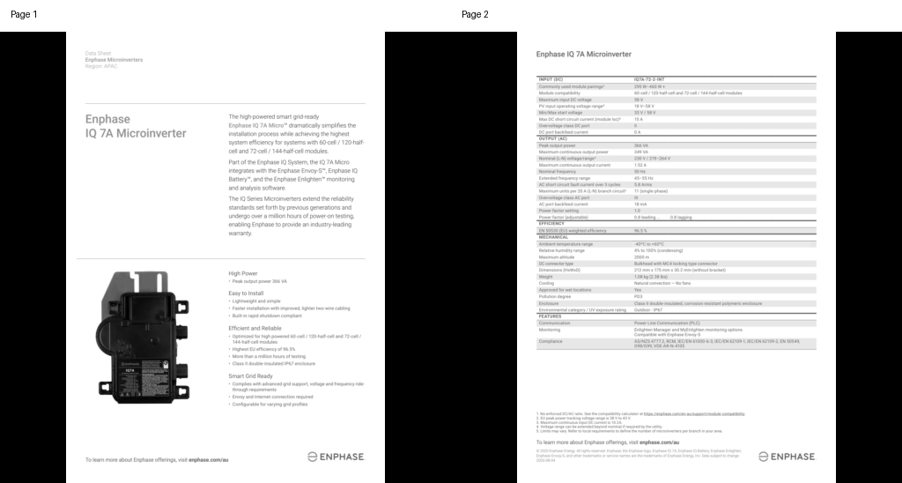

# Dataset preparation

The SFT recipe uses three small, explicit data tracks. The preparation script
pins every source revision and writes local JSONL in Axolotl's OpenAI Messages
format. Image bytes are saved as local RGB PNG files, so training workers do not
fetch image URLs.

Run these commands from `post-training/sft/axolotl/`:

```bash
MODEL=meta-models/Muse-Glimmer-30B
REVISION=a4e59da52a7bc87ae7251dd5545c0dd437c44b68

python scripts/prepare_dataset.py tulu \
  --tokenizer-model "$MODEL" --tokenizer-revision "$REVISION" \
  --max-tokens 4096
python scripts/prepare_dataset.py cosyn-circuit \
  --tokenizer-model "$MODEL" --tokenizer-revision "$REVISION" \
  --max-tokens 4096
python scripts/prepare_dataset.py docmatix \
  --tokenizer-model "$MODEL" --tokenizer-revision "$REVISION" \
  --max-tokens 4096
```

Use `all` in place of a dataset name to prepare all three. Existing output is
never replaced unless `--overwrite` is given. An overwrite is allowed only
when the existing manifest identifies the same scenario and output name.
Symlink outputs are rejected, and a failed replacement restores the previous
validated output.

## Sources

The source dataset cards report:

- Text: [Tulu 3 personas][tulu], ODC-BY-1.0, 29,980 train rows.
- Single image: [CoSyn-400K][cosyn] `circuit`, ODC-BY-1.0, 10,470
  train rows and 128 validation rows.
- Multi-image: [Docmatix][docmatix] `zero-shot-exp`, MIT, 1,700 train
  rows and 200 test rows.

The script pins these revisions:

```text
Tulu:    fe0c7d350c9b4542b8d829a6f1daa1c259f0ba0e
CoSyn:   86e46e1fd5e754d056169f0fb38f06c6997ff7de
Docmatix: 0725b65616e0e5f6024be10e38ddf8d8c48664fd
```

Read each dataset card and its linked terms before use. CoSyn's card also points
to Ai2's Responsible Use Guidelines and provider terms for its synthetic image
code and questions. Docmatix documents can contain names, addresses, signatures,
or other public personal and business information. Apply the privacy and safety
review required by your use case.

## Output layout

The default outputs are ignored by Git:

```text
data/prepared/
|-- tulu/
|   |-- train.jsonl
|   |-- validation.jsonl
|   `-- manifest.json
|-- cosyn-circuit/
|   |-- images/{train,validation}/*.png
|   |-- train.jsonl
|   |-- validation.jsonl
|   `-- manifest.json
`-- docmatix/
    |-- images/{train,validation,test}/*.png
    |-- train.jsonl
    |-- validation.jsonl
    |-- test.jsonl
    `-- manifest.json
```

Image paths in JSONL are absolute. Re-run preparation if the output directory is
moved. The manifest records the source revision, source row counts, filtering,
split parameters, aggregate text, image, and optional token lengths, plus
SHA256 digests for each JSONL file, its sorted selected IDs, and every prepared
image set. The JSONL digest changes if the absolute output path changes. The
selected-ID and image-content digests do not depend on source row order.

## Normalization behavior

Tulu already contains `messages` with string `role` and `content` fields. The
script retains those turns and assigns rows to train or validation by hashing
the source ID with the seed. This assignment does not depend on source row
order.

Each CoSyn row holds one image and several parallel question, explanation, and
answer lists. The script makes one two-turn conversation per QA pair. Every QA
for a source row reuses the same image path, so the image is written only once.
Assistant `content` contains the visible explanation followed by a clearly
marked final answer. It does not use hidden `reasoning_content`. The official
train and validation split is retained.

Docmatix stores up to four ordered page images and several QA turns per
document. The script selects rows with two to four images. It puts every page
image, in source order, directly in the first user message before the question.
This is important because Axolotl 0.19.0 only uses the first image from its
legacy top-level `images` compatibility path. The upstream train split is
hash-split into train and validation. The upstream test split remains test and
is never used for training. Docmatix IDs derive from the source split, texts,
and image count, not the Hub row position.

## Concrete examples from the measured slices

These records are copied from the deterministic training slices used for the
measured runs. Image paths are shortened to their prepared-directory suffixes;
the generated JSONL contains absolute paths.

### Tulu text example

```json
{
  "id": "personas_IF_08kzvdvcacy74rma4vmqhywz",
  "messages": [
    {
      "role": "user",
      "content": "List three organisms that play a role in decomposition using no comma"
    },
    {
      "role": "assistant",
      "content": "Fungi earthworms bacteria"
    }
  ]
}
```

This example exercises instruction following and a formatting constraint without
any image parts. Tulu is the text-only track, so there is no sample image by
design.

### CoSyn single-image example

```json
{
  "id": "LaTeXCircuitPipeline_Amplifier_4-21-qa-04",
  "messages": [
    {
      "role": "user",
      "content": [
        {
          "type": "image",
          "path": "images/train/LaTeXCircuitPipeline_Amplifier_4-21-6aac6d8916ec-00.png"
        },
        {
          "type": "text",
          "text": "How many resistors are present in the circuit?"
        }
      ]
    },
    {
      "role": "assistant",
      "content": "There are three resistors in total: Rk, Rg, and Rp.\n\nAnswer: Three"
    }
  ]
}
```

The stable ID identifies one QA pair from a source row. Other questions for the
same circuit reuse the saved image.


The displayed 512x512 PNG is the exact prepared image referenced by the JSON
example. It comes from the pinned CoSyn `circuit` subset, whose dataset card
lists ODC-BY-1.0.

### Docmatix multi-image example

```json
{
  "id": "docmatix-train-43582e4cc2ae7af77698912c",
  "messages": [
    {
      "role": "user",
      "content": [
        {
          "type": "image",
          "path": "images/train/docmatix-train-43582e4cc2ae7af77698912c-ffb9d5e8f8e9-00.png"
        },
        {
          "type": "image",
          "path": "images/train/docmatix-train-43582e4cc2ae7af77698912c-ffb9d5e8f8e9-01.png"
        },
        {
          "type": "text",
          "text": "What environmental and safety features are included in the Enphase IQ 7A Micro inverter design?"
        }
      ]
    },
    {
      "role": "assistant",
      "content": "The Enphase IQ 7A Micro inverter features an ambient temperature range of -40ºC to +60ºC, a relative humidity range of 4% to 100% (condensing), and is approved for wet locations. It has a high pollution degree (PD3) and is housed in a corrosion-resistant double insulated polymeric enclosure. The enclosure is classified as Class II and is rated IP67 for outdoor usage."
    }
  ]
}
```



The montage shows the two exact 512x512 prepared pages, left to right in model
input order. Both pages precede the question. The measured evaluation also
removes the first page and reverses page order to check that training is not
silently using only image zero. This example comes from the pinned Docmatix
`zero-shot-exp` subset, whose dataset card lists MIT. Review the rights and
privacy properties of each source document before redistributing your own
samples.

## Reproducibility and preflight checks

The source revisions and expected upstream row counts are constants in the
script. Preparation stops if a pinned source returns a different count, an image
cannot be decoded, IDs collide, a required assistant target is missing, or an
example violates its modality's image-count contract.

The default image size is 512 by 512 with aspect-preserving black padding. This
keeps multi-image visual token use practical and makes decoding independent of
training-time network access. Set `--image-size 0` only when preserving original
resolution is more important than predictable memory use.

For a quick pipeline check, cap each output split:

```bash
python scripts/prepare_dataset.py docmatix \
  --max-examples-per-split 16
```

The script sorts normalized examples by stable ID before applying
`--max-examples-per-split`, so capped outputs and their selected-ID digests are
independent of source row order.

Character and image counts are always recorded. The commands at the top run an
exact processor-level token check without loading model weights.

The tokenizer revision defaults to that pinned Muse Glimmer revision. To use a
processor already stored on disk without a network request, pass its path with
`--tokenizer-local-files-only`.

This check is slower because it decodes and processes every selected image. It
is worth running before a full training job. Axolotl's multimodal path does not
currently truncate or drop over-length examples for each architecture, and
multimodal sample packing is unsupported.

`--max-examples-per-split` limits written rows, not Hub download size. Hugging
Face may still download a complete Parquet shard. Counts in dataset cards are
row counts, not QA counts: one CoSyn or Docmatix row contains several QA turns.
The script reports output conversation and assistant-turn totals in each
manifest.

For deletion safety, `--output-root` cannot be the filesystem root, home
directory, recipe root, or repository root. Use a dedicated data directory.

[tulu]: https://hf.co/datasets/allenai/tulu-3-sft-personas-instruction-following
[cosyn]: https://hf.co/datasets/allenai/CoSyn-400K
[docmatix]: https://hf.co/datasets/HuggingFaceM4/Docmatix
